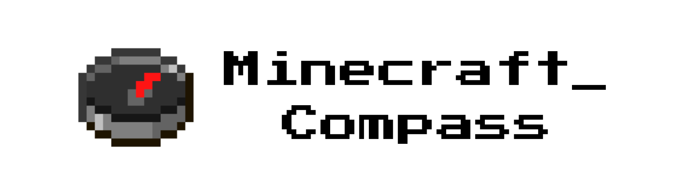

<p align="center"></p>

A real, working compass for Android and iOS, drawn as the Minecraft-style pixel
compass. It reads the phone's magnetometer and shows the frame whose needle
points to magnetic north. The needle swings on a damped spring, so it wobbles
into place instead of snapping.

## Running

Use a real phone, because emulators have no compass sensor:

```bash
flutter pub get
flutter run
```

## Frames

The 64 frames live in `assets/frames/` as `frame_01.png` ... `frame_64.png`
(160x160, drawn without smoothing so the pixels stay sharp).

- `frame_01` shows the needle pointing straight down.
- Each next frame turns the needle a further 5.625° (360 / 64) clockwise.

If you swap in frames with a different start or direction, change
`kFirstFrameAngle` / `kFramesClockwise` in `lib/main.dart`.

If the phone has no compass sensor, the needle spins like a Minecraft compass
in the Nether.

## App icon

The logo and all launcher icons (Android legacy + adaptive, iOS) are generated
from `frame_41.png`:

```bash
python tool/make_icons.py   # needs Pillow
```

## Notes

- Points to **magnetic** north, not true north.
- If the heading is jumpy or a "Low accuracy" warning appears, move the phone in
  a figure 8 to calibrate it, and keep it away from magnets and metal.
- Neither Android nor iOS needs a permission for the compass heading.


## Other

There is a similar repository I made called Minecraft_Clock, Check it out here: [*Minecraft_Clock*](https://github.com/Squidly1408/Minecraft_clock/)
